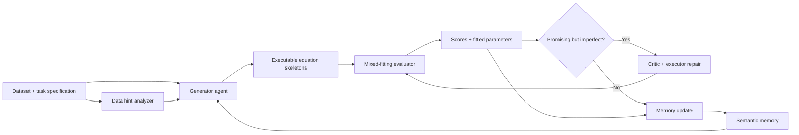

# STRIDE

> Self-reflective agent framework for reliable automatic equation discovery.

STRIDE discovers compact symbolic equations from data with an LLM-guided, feedback-driven search loop. It extends the LLM-SR-style generate-fit-score-memory pipeline with data-aware generation, mixed parameter fitting, critic-executor repair, and diversity-preserving semantic memory.

Developed from the [LLM-SR](https://arxiv.org/abs/2404.18400) codebase.

<p align="center">
  <a href="./fig/1_motivation.pdf"><strong>Motivation figure</strong></a>
  &nbsp;|&nbsp;
  <a href="./fig/framework.pdf"><strong>Framework figure</strong></a>
</p>

## What STRIDE Adds

- **Data-aware sampling**: extracts lightweight hints from the training data, including scale statistics, bias tendency, symmetry cues, and dominant feature terms.
- **Mixed parameter fitting**: separates linear and nonlinear/coupled parameters where possible, solves linear weights with least-squares probes, and keeps BFGS/L-BFGS-B as a fallback.
- **Critic-executor repair**: reflects on promising but imperfect equations using fitted scores and parameters, then rewrites candidates through constrained edit actions.
- **Semantic memory**: stores diverse high-scoring equations in a multi-island buffer using canonicalized TF-IDF similarity instead of only score signatures.
- **Benchmark-ready specs**: includes representative LLM-SR tasks and LSR-Synth-style suites for oscillator, biology, chemistry, and materials-science cases.

## Workflow



The loop is intentionally role-based: the generator proposes symbolic structures, the evaluator performs numerical fitting and scoring, the critic-executor repairs viable candidates, and semantic memory feeds diverse elite examples back into later prompts.

## Installation

Python 3.11 is recommended. Python 3.9 or newer should work with compatible dependency builds.

```bash
conda create -n stride python=3.11
conda activate stride
pip install -r requirements.txt
```

Alternatively, create the environment from the provided Conda file:

```bash
conda env create -f environment.yml
conda activate stride
```

`requirements.txt` currently points to PyTorch CUDA 11.8 wheels. For CPU-only or another CUDA version, install the matching PyTorch build from the [official PyTorch selector](https://pytorch.org/get-started/locally/) before installing the remaining dependencies.

## Quick Start

Run commands from the repository root.

### Bash / Git Bash

```bash
export OPENAI_API_KEY="YOUR_KEY"
export OPENAI_BASE_URL="https://api.openai.com/v1"  # OPENAI_API_BASE also works

python codes/main.py --use_api True --api_model "gpt-5.1" \
  --problem_name oscillator1 \
  --spec_path ./specs/specification_oscillator1.txt \
  --log_path ./logs/oscillator1_api
```

### PowerShell

```powershell
$env:OPENAI_API_KEY = "YOUR_KEY"
$env:OPENAI_BASE_URL = "https://api.openai.com/v1"

python codes/main.py --use_api True --api_model "gpt-5.1" `
  --problem_name oscillator1 `
  --spec_path ./specs/specification_oscillator1.txt `
  --log_path ./logs/oscillator1_api
```

The API client is OpenAI-compatible and uses `/v1/chat/completions`. Set `OPENAI_BASE_URL` or `OPENAI_API_BASE` for OpenAI-compatible services; the client appends `/v1` automatically if it is missing.

## Command-Line Options

| Option | Default | Description |
| --- | --- | --- |
| `--problem_name` | `oscillator1` | Dataset path relative to `./data`; the folder must contain `train.csv`. |
| `--spec_path` | required | Specification file that defines the equation template, evaluator, and task constraints. |
| `--log_path` | `./logs/oscillator1` | Directory for generated programs, scores, and run logs. |
| `--use_api` | `False` | Compatibility flag; the current sampler uses the OpenAI-compatible API client. |
| `--api_model` | `gpt-5.1` | Model name sent to the chat-completions endpoint. |
| `--data_hint_enabled` | `False` | Enables data-derived prompt hints from `codes/sample/dataset_analyzer.py`. |
| `--data_hint_every` | `25` | Inject data hints every N prompts; use `0` or a negative value to inject every prompt. |
| `--ablation` | `none` | Ablation selector: `data_hint`, `critic`, `tf_idf`, or `mixed_optimization`. |
| `--no_early_stop_train_nmse` | off | Disables early stop when train NMSE is already near zero. |

## Benchmarks and Specifications

### Representative Tasks

| Dataset | Problem name | Specification |
| --- | --- | --- |
| Oscillator 1 | `oscillator1` | `specs/specification_oscillator1.txt` |
| Oscillator 2 | `oscillator2` | `specs/specification_oscillator2.txt` |
| E. coli growth | `bactgrow` | `specs/specification_bactgrow.txt` |
| Stress-strain | `stressstrain` | `specs/specification_stressstrain.txt` |

Example:

```bash
python codes/main.py --use_api True --api_model "gpt-5.1" \
  --problem_name stressstrain \
  --spec_path ./specs/specification_stressstrain.txt \
  --log_path ./logs/stressstrain_api
```

### LSR-Synth-Style Suites

| Family | Example problem name | Specification |
| --- | --- | --- |
| Chemical reaction kinetics | `benchmark_dr/lsr_synth/chem_react/CRK19` | `specs/benchmark/specification_CRK.txt` |
| Bio population growth | `benchmark_dr/lsr_synth/bio_pop_growth/BPG19` | `specs/benchmark/specification_BPG.txt` |
| Physical oscillator | `benchmark_dr/lsr_synth/phys_osc/PO14` | `specs/benchmark/specification_PO.txt` |
| Materials science | `benchmark_dr/lsr_synth/matsci/MatSci3` | `specs/benchmark/specification_MatSci.txt` |

More runnable examples are collected in `run_llmsr.sh`.

## Project Layout

| Path | Role |
| --- | --- |
| `codes/main.py` | CLI entry point; adds the repository root to `PYTHONPATH`. |
| `codes/pipeline.py` | Coordinates initialization, sampling, evaluation, and memory updates. |
| `codes/sample/` | LLM sampling, data-hint generation, and the refinement loop. |
| `codes/evaluate/` | Program evaluation, sandbox execution, profiling, and critic metadata handling. |
| `codes/refine/` | Critic implementation that proposes structured repair actions. |
| `codes/update/` | Multi-island experience buffer and semantic TF-IDF clustering. |
| `specs/` | Task specifications and executable evaluation templates. |
| `specs/benchmark/` | Shared specs for LSR-Synth-style benchmark families. |
| `data/` | Training, in-distribution test, and out-of-distribution test CSV files. |
| `fig/` | Paper figures used for motivation and framework overview. |
| `logs/` | Default output location for experiment traces. |

## Ablations

STRIDE exposes ablation switches for comparing core components:

```bash
python codes/main.py --use_api True --api_model "gpt-5.1" \
  --problem_name oscillator1 \
  --spec_path ./specs/specification_oscillator1.txt \
  --log_path ./logs/oscillator1_no_critic \
  --ablation critic
```

Supported ablation names are declared in `codes/main.py`. The current entry point directly toggles data hints, critic probability, and TF-IDF memory clustering; mixed fitting is implemented inside the specification files.

## Results Summary

The accompanying paper evaluates STRIDE on representative symbolic-regression tasks and LSR-Synth suites under both ID and OOD settings. The reported results show that STRIDE improves reliability over generation-centered LLM-SR-style loops by recovering more accurate and structurally robust equations. Ablations indicate that each module contributes to final performance, with mixed fitting and semantic memory especially important for preserving useful equation structures under distribution shift.

## Acknowledgments

This repository builds on [LLM-SR](https://arxiv.org/abs/2404.18400). Related benchmark resources include [LLM-SRBench](https://arxiv.org/abs/2504.10415) and its [Hugging Face dataset](https://huggingface.co/datasets/nnheui/llm-srbench).

## License

This project is released under the MIT License. See `LICENSE` for details. Check the upstream projects linked from the original LLM-SR release, including FunSearch and PySR, for their respective terms.
