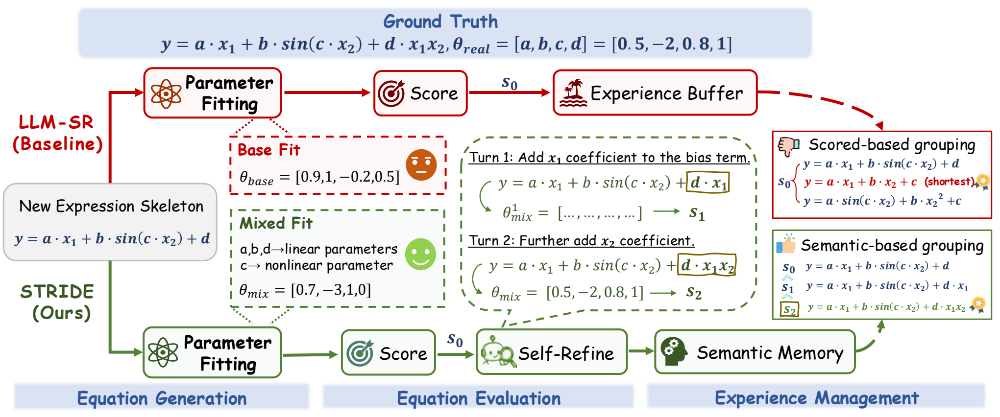
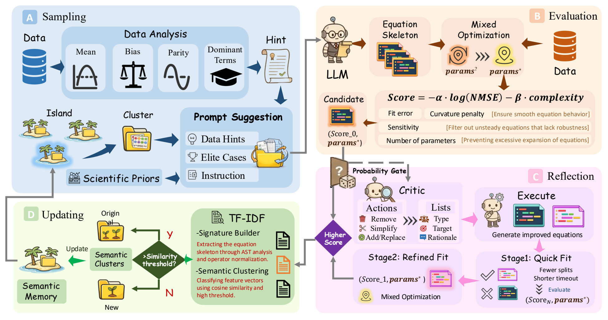

# STRIDE

> 🚀 Self-reflective agent framework for reliable automatic equation discovery.

STRIDE discovers compact symbolic equations from data with an LLM-guided, feedback-driven search loop. It extends the LLM-SR-style generate-fit-score-memory pipeline with data-aware sampling, mixed parameter fitting, critic-executor repair, and diversity-preserving semantic memory.

## 📜 Content

- [Overview](#overview)
- [Motivation](#motivation)
- [Framework](#framework)
- [Key Features](#key-features)
- [Installation](#installation)
- [Quick Start](#quick-start)
- [Command-Line Options](#command-line-options)
- [Benchmarks and Specifications](#benchmarks-and-specifications)
- [Project Layout](#project-layout)
- [Results Summary](#results-summary)
- [Acknowledgments](#acknowledgments)
- [License](#license)

## Overview

Recently, LLM-based equation discovery has become a practical route for recovering interpretable symbolic laws from data. However, generation-centered pipelines can still discard useful skeletons when fitting is unreliable, abandon near-correct equations instead of repairing them, and accumulate redundant experience in memory.

STRIDE addresses these issues with a role-based self-reflective workflow. A generator proposes equation skeletons, an evaluator fits and scores them, a critic-executor pair repairs promising candidates, and a semantic memory module keeps diverse high-quality structures for later prompts. The goal is not only low training error, but also robust structure recovery under in-distribution and out-of-distribution settings.

## Motivation

<p align="center">
  
</p>

As illustrated in the motivation figure, current generation-centered pipelines usually proceed by proposing equation skeletons, fitting their parameters, scoring the fitted candidates, storing experience according to those scores, and later retrieving examples from score-based clusters, often favoring shorter skeletons within equally scored groups. This design creates several failure modes: useful skeletons may be discarded when unreliable parameter fitting underestimates their potential; near-correct equations may be abandoned rather than locally repaired; and complex but informative hypotheses may be lost under short-term fitness or length bias. These limitations suggest that reliable LLM-based equation discovery should be organized as a multi-role reflective agent workflow, where generation, evaluation, critique, repair, and memory updating are distinct but coordinated roles.

## Framework

<p align="center">
  
</p>

STRIDE organizes automatic equation discovery into four coordinated roles:

- 🧠 **Sampling**: builds prompts from task instructions, data hints, scientific priors, and elite memory cases.
- 🎯 **Evaluation**: fits generated skeletons with mixed optimization and scores them by accuracy and complexity.
- 🔁 **Reflection**: uses critic feedback and executor rewriting to improve promising but imperfect candidates.
- 🌴 **Updating**: stores high-quality equations in semantic clusters to keep memory compact and diverse.

## Key Features

- 📊 **Data-aware sampling**: The generator agent builds prompts from task instructions, retrieved elite cases, and data hints extracted from the training set, including scale statistics, bias tendency, parity patterns, and dominant candidate terms.
- 🧮 **Mixed parameter fitting**: The evaluator parses each candidate skeleton, separates linear coefficients from nonlinear or coupled parameters, solves the inner linear fit under outer nonlinear search, and returns fitted parameters with NMSE/complexity feedback.
- 🛠️ **Critic-executor repair**: For promising but imperfect candidates, STRIDE triggers a critic to diagnose fitted behavior and propose local edit actions; the executor converts these actions into executable refinements for re-evaluation.
- 🧭 **Semantic memory**: After evaluation or repair, selected equations are canonicalized, encoded with TF-IDF signatures, assigned to semantic clusters, and retained as diverse elite exemplars for later prompts.
- 🧪 **Benchmark-ready specs**: The repository packages executable specifications and datasets for representative LLM-SR tasks and LSR-Synth-style domains, enabling direct runs on oscillator, biology, chemistry, and materials-science cases.

## Installation

Python 3.11 is recommended. Python 3.9 or newer should work with compatible dependency builds.

```bash
conda create -n stride python=3.11
conda activate stride
pip install -r requirements.txt
```

Alternatively, create the environment from the provided Conda file:

```bash
conda env create -f environment.yml
conda activate stride
```

`requirements.txt` currently points to PyTorch CUDA 11.8 wheels. For CPU-only or another CUDA version, install the matching PyTorch build from the [official PyTorch selector](https://pytorch.org/get-started/locally/) before installing the remaining dependencies.

## Quick Start

Run commands from the repository root.

### Bash / Git Bash

```bash
export OPENAI_API_KEY="YOUR_KEY"
export OPENAI_BASE_URL="https://api.openai.com/v1"  # OPENAI_API_BASE also works

python codes/main.py --use_api True --api_model "gpt-5.1" \
  --problem_name oscillator1 \
  --spec_path ./specs/specification_oscillator1.txt \
  --log_path ./logs/oscillator1_api
```

### PowerShell

```powershell
$env:OPENAI_API_KEY = "YOUR_KEY"
$env:OPENAI_BASE_URL = "https://api.openai.com/v1"

python codes/main.py --use_api True --api_model "gpt-5.1" `
  --problem_name oscillator1 `
  --spec_path ./specs/specification_oscillator1.txt `
  --log_path ./logs/oscillator1_api
```

The API client is OpenAI-compatible and uses `/v1/chat/completions`. Set `OPENAI_BASE_URL` or `OPENAI_API_BASE` for OpenAI-compatible services; the client appends `/v1` automatically if it is missing.

## Command-Line Options

| Option | Default | Description |
| --- | --- | --- |
| `--problem_name` | `oscillator1` | Dataset path relative to `./data`; the folder must contain `train.csv`. |
| `--spec_path` | required | Specification file that defines the equation template, evaluator, and task constraints. |
| `--log_path` | `./logs/oscillator1` | Directory for generated programs, scores, and run logs. |
| `--use_api` | `False` | Compatibility flag; the current sampler uses the OpenAI-compatible API client. |
| `--api_model` | `gpt-5.1` | Model name sent to the chat-completions endpoint. |
| `--data_hint_enabled` | `False` | Enables data-derived prompt hints from `codes/sample/dataset_analyzer.py`. |
| `--data_hint_every` | `25` | Inject data hints every N prompts; use `0` or a negative value to inject every prompt. |
| `--no_early_stop_train_nmse` | off | Disables early stop when train NMSE is already near zero. |

## Benchmarks and Specifications

### Representative Tasks

| Dataset | Problem name | Specification |
| --- | --- | --- |
| Oscillator 1 | `oscillator1` | `specs/specification_oscillator1.txt` |
| Oscillator 2 | `oscillator2` | `specs/specification_oscillator2.txt` |
| E. coli growth | `bactgrow` | `specs/specification_bactgrow.txt` |
| Stress-strain | `stressstrain` | `specs/specification_stressstrain.txt` |

Example:

```bash
python codes/main.py --use_api True --api_model "gpt-5.1" \
  --problem_name stressstrain \
  --spec_path ./specs/specification_stressstrain.txt \
  --log_path ./logs/stressstrain_api
```

### LSR-Synth-Style Suites

| Family | Example problem name | Specification |
| --- | --- | --- |
| Chemical reaction kinetics | `benchmark_dr/lsr_synth/chem_react/CRK19` | `specs/benchmark/specification_CRK.txt` |
| Bio population growth | `benchmark_dr/lsr_synth/bio_pop_growth/BPG19` | `specs/benchmark/specification_BPG.txt` |
| Physical oscillator | `benchmark_dr/lsr_synth/phys_osc/PO14` | `specs/benchmark/specification_PO.txt` |
| Materials science | `benchmark_dr/lsr_synth/matsci/MatSci3` | `specs/benchmark/specification_MatSci.txt` |

More runnable examples are collected in `run_llmsr.sh`.

## Project Layout

| Path | Role |
| --- | --- |
| `codes/main.py` | CLI entry point; adds the repository root to `PYTHONPATH`. |
| `codes/pipeline.py` | Coordinates initialization, sampling, evaluation, and memory updates. |
| `codes/sample/` | LLM sampling, data-hint generation, and the refinement loop. |
| `codes/evaluate/` | Program evaluation, sandbox execution, profiling, and critic metadata handling. |
| `codes/refine/` | Critic implementation that proposes structured repair actions. |
| `codes/update/` | Multi-island experience buffer and semantic TF-IDF clustering. |
| `specs/` | Task specifications and executable evaluation templates. |
| `specs/benchmark/` | Shared specs for LSR-Synth-style benchmark families. |
| `data/` | Training, in-distribution test, and out-of-distribution test CSV files. |
| `fig/` | Paper figures and README-rendered PNG assets. |
| `logs/` | Default output location for experiment traces. |

## Results Summary

The accompanying paper evaluates STRIDE on representative symbolic-regression tasks and LSR-Synth suites under both ID and OOD settings. The reported results show that STRIDE improves reliability over generation-centered LLM-SR-style loops by recovering more accurate and structurally robust equations. Component analyses further highlight the value of fitting-aware feedback, targeted repair, and semantic memory for reliable equation discovery.

## Acknowledgments

This repository builds on [LLM-SR](https://arxiv.org/abs/2404.18400). Related benchmark resources include [LLM-SRBench](https://arxiv.org/abs/2504.10415) and its [Hugging Face dataset](https://huggingface.co/datasets/nnheui/llm-srbench).

## License

This project is released under the MIT License. See `LICENSE` for details. Check the upstream projects linked from the original LLM-SR release, including FunSearch and PySR, for their respective terms.
